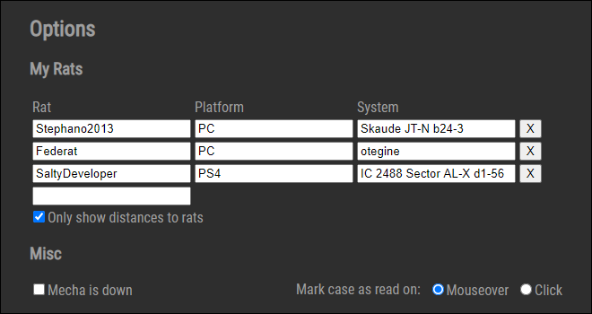

## FuelRats Dispatch Helper

[Check it out!](https://dispatch.stefanpuia.co.uk)

_**NOTE**: you will need the irc client server to be running locally for this to work_

A dispatch board meant to help dispatchers dispatch dispatchingly.

Preview:


### Automated features include:

-   #fuelrats and #ratchat live chat
-   case detection
-   client connect/disconnect
-   nick changes
-   jump calls
-   fr, wr, bc, fuel, sysconf, stdn calls
-   rat assignment/unassignment
-   code red
-   case active/inactive
-   case closing/md
-   chat grabbing from client, assigned rats, messages that contain the case number or the client name
-   automatic pastes based on case context (WR instructions when at least one rat has FR etc.)
-   Mecha-down detection (if Mecha goes offline, it will provide the fact text, rather than the !facts)

### How to use

-   the application is pretty much automated, but there is no history, so it will only register cases from when it was openend in the browser.
-   case number:
    -   green: xbox
    -   blue: playstation
    -   orange: PC
-   system name red: system is not confirmed (will go white if sysconf detected)
-   language will be white if english, red otherwise
-   client name will go red and underlined if they are disconnected
-   case background will be green if there is a new message
-   **in case something goes wrong with a case, clicking on the case number will remove the case from the dashboard**

### Advanced features

**Search box**:


-   allows searching of all the case facts.
-   The syntax is: `[#] [platform] [language] command [- parameters]` (all parts in `[]` can be omitted)
-   if a case number is used, it will use the respective case's information (i.e. FR will say which rats to send the requests to)
-   language and platform modifiers will override the case number data
-   paramters currently only work for the `eta` (1 parameters, number) and `also fr` & `also wr` (any parameters, strings, separated by comma)

**Options window**:



-   allows you to save your rats and their systems, so you can see the distance from the client to them, instead of the waypoints
-   toggle between showing distances to a mix of rat + waypoints and only rats
-   manual Mecha-down toggle

## Installation

-   clone the repository
-   `cd dispatch-helper`
-   `npm i`
-   `cd server`
-   `npm i`

### To run this app in both development and web mode, you need the irc reader to be running locally

-   in the `server/src` folder
-   edit the `config.json` file with your credentials
-   run `node server.js`

_by default the server will log direct messages to server/src/irc.log_

example `config.json`

```json
{
    "disptach-port": 45362, // this needs to stay the same, unless changed in the react app as well
    "irc-server": "kiwi.fuelrats.com",
    "irc-port": "6667",
    "irc-name": "yourUserName",
    "irc-nick": "yourNickName", // bear in mind that you will need to use a different nick if you are already connected
    "irc-realname": "", // not required
    "irc-password": "myLovelyPassword", // your irc identify password
    "notify": [
        // optional regex to capture messages that will be outputted to irc.log in the server/src folder
        [
            "my name", // expression
            "gi" // flags
        ]
    ]
}
```
